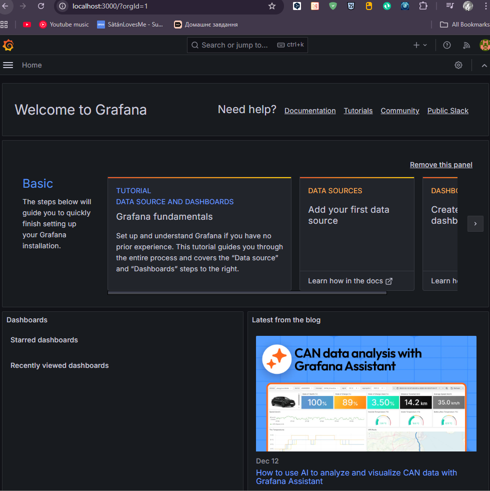
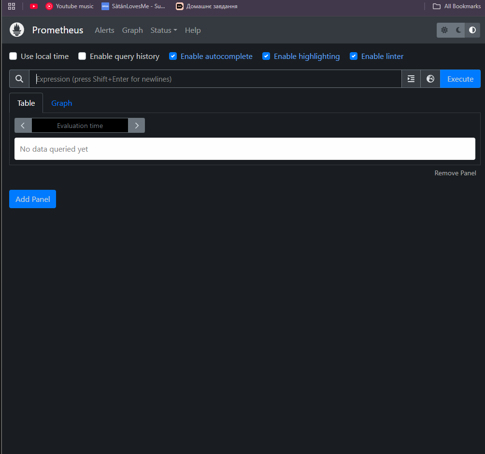
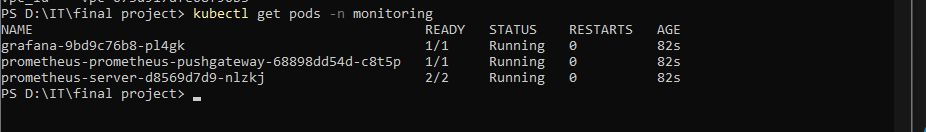
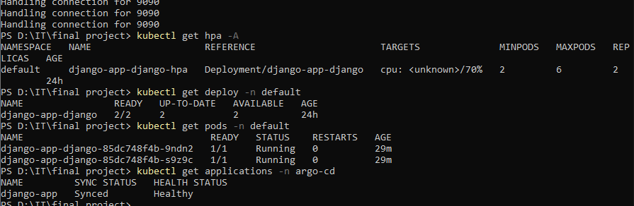

# Final DevOps Project

AWS інфраструктура розгорнута через Terraform.

## Стек

- AWS (VPC, EKS, RDS, ECR, S3, DynamoDB)
- Kubernetes (EKS)
- Jenkins (Helm)
- Argo CD (Helm)
- Prometheus + Grafana (Helm)
- Django app (Helm chart + HPA)

---

## Розгортання

```bash
terraform init
terraform plan
terraform apply
```

Перевірка namespace:

```bash
kubectl get all -n jenkins
kubectl get all -n argo-cd
kubectl get all -n monitoring
```

---

## Jenkins

Port-forward:

```bash
kubectl port-forward svc/jenkins 8080:8080 -n jenkins
```

Jenkins pipeline:
- build Docker image
- push to ECR
- update Helm chart

---

## Argo CD

Пароль admin:

```bash
kubectl -n argo-cd get secret argocd-initial-admin-secret \
-o jsonpath="{.data.password}" | base64 -d
```

Port-forward:

```bash
kubectl port-forward svc/argocd-server -n argo-cd 8081:443
```

Django application статус:

```
kubectl get applications -n argo-cd
```

Healthy / Synced ✔

---

## Monitoring

Grafana:

```bash
kubectl port-forward svc/grafana 3000:80 -n monitoring
```

Prometheus:

```bash
kubectl port-forward svc/prometheus-server 9090:80 -n monitoring
```

---

## Autoscaling (HPA)

```bash
kubectl get hpa -A
```

Django HPA:
- min pods: 2
- max pods: 6
- CPU target: 70%

---

## Перевірка Django

```bash
kubectl get deploy -n default
kubectl get pods -n default
kubectl get applications -n argo-cd
```

Статус:
- Deployment Ready
- Pods Running
- ArgoCD Healthy

---

## Скріни

Grafana UI  


Prometheus UI  


Monitoring pods  


Django + HPA + Argo status  


---

## Видалення інфраструктури

⚠️ Після перевірки обов'язково:

```bash
terraform destroy
```

